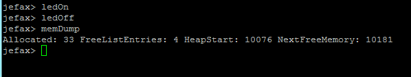

jefax
=====

jefax is a small kernel for atmels xmega microcontroller. It supports preemptive scheduling and dynamic memory management. To synchronize tasks semaphores and mutex can be used. A shell via USART is provided, to communicate with the xmega.  

For further information: [documentation (in german)](doc/JefaxDesign.pdf)

